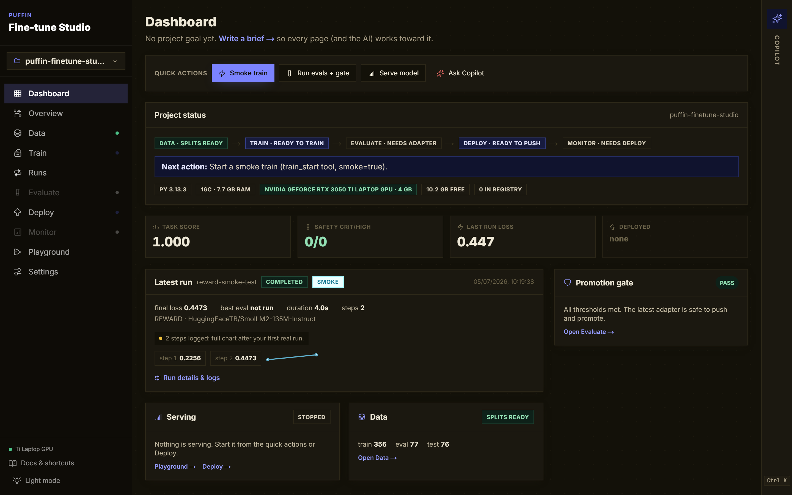
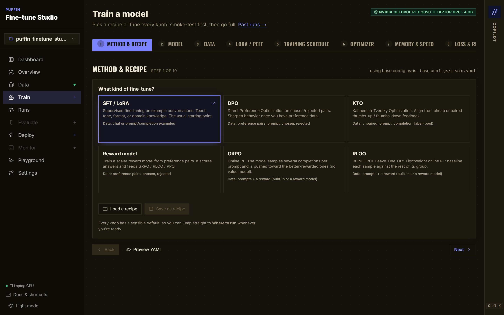
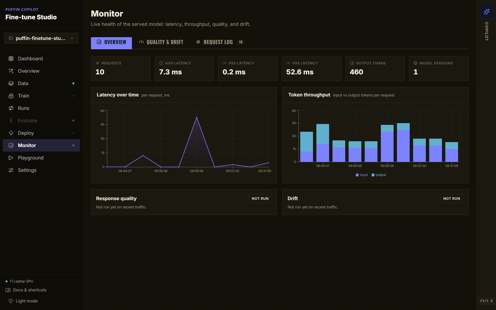

<div align="center">

# puffin-finetune-studio

**A visual studio for fine-tuning open LLMs, backed by a production MLOps engine.**

Do the whole workflow (data, training, evals, deploy, monitoring) in your browser or by
chatting with an AI. Under the hood is a reproducible, config-driven engine (SFT / LoRA /
DPO with eval gates, a model registry, and cloud-portable serving) that you can also drive
headless from the CLI.

[](https://github.com/m-ahmed-elbeskeri/puffin-finetune-studio/actions/workflows/llmops-ci.yml)
[](LICENSE)
[](https://www.python.org/downloads/)
[](https://github.com/astral-sh/ruff)
[](CONTRIBUTING.md)

[Quickstart](#quickstart) · [The Studio](#the-studio) · [Why](#why-a-studio) · [Under the hood](#under-the-hood-the-engine) · [Docs](#documentation) · [Contributing](#contributing)

<br>



</div>

---

## TL;DR

```bash
pip install "puffin-finetune-studio[copilot]"
finetune-copilot          # opens Puffin Studio in your browser
```

That one command starts the engine and the web UI, waits for both, and drops you into a
point-and-click (or chat-driven) workspace for the whole fine-tuning lifecycle. Everything
the studio does, the engine underneath also exposes as the `puffin` CLI and a Python API,
so you can automate the exact same workflow in CI.

> **The reusable contract:** a new project is a new config plus a new dataset plus new evals.
> Not a new platform every time.

---

## Why a studio?

Fine-tuning usually lives in a pile of one-off scripts and notebooks only the ML engineer
can drive, on top of a training/serving stack that quietly drifts out of sync. Puffin makes
it a **studio anyone on the team can use**, backed by an engine that keeps every run
reproducible and production-safe.

| The usual pain | What the studio + engine give you |
| --- | --- |
| Fine-tuning is expert-only, CLI-only | A visual studio: pick a recipe or tune every knob, run the pipeline, evals, and deploy from the browser, or just **ask the AI** to do it. |
| Training/serving skew (the #1 silent failure) | Training and serving share the **same** prompt builder, chat template, tokenizer, and schemas (`src/llmops/features/`). |
| "Which data/model/seed produced this?" | Every run records git SHA, config hash, dataset version, base-model revision, seed, and package versions. |
| A bad model reaches production | A **hard promotion gate** on task / safety / regression / latency that blocks the release. |
| Locked into one cloud | Provider adapters for `local`, `gcp`, `aws`, `azure`, `kubernetes`, selected in config. |
| No visibility in production | Built-in request logs (PII-redacted), Prometheus metrics, a drift monitor, and an LLM-judge quality monitor, all on the Monitor page. |

---

## Quickstart

### Prerequisites

- Python **3.11+**
- Node.js **18.18+** (for the studio web UI)
- ~1 GB free disk for the smoke model; no GPU required for the smoke path

### Open the studio

```bash
pip install "puffin-finetune-studio[copilot]"

# optional: unlock the AI chat (the studio itself works without it)
export ANTHROPIC_API_KEY="sk-ant-..."     # PowerShell: $env:ANTHROPIC_API_KEY="sk-ant-..."

finetune-copilot                          # starts everything, opens your browser
```

`finetune-copilot` installs the frontend's npm deps on first run, launches the engine + UI,
and opens the studio. `finetune-copilot doctor` checks your environment; `finetune-copilot
--prod` serves a prebuilt UI from a single port with no Node.js at runtime.

No `ANTHROPIC_API_KEY`? The chat also drives any local agent CLI you already have installed
and authed (Claude Code, Codex, Gemini, Qwen, OpenCode, Cursor, GitHub Copilot).

### Or drive the engine headless (CLI / CI)

Prefer YAML and a terminal, or automating in CI? Clone the repo and run the same golden path
without the UI:

```bash
git clone https://github.com/m-ahmed-elbeskeri/puffin-finetune-studio
cd puffin-finetune-studio
cp .env.example .env
make setup           # engine + dev extras
make train-smoke     # tiny CPU smoke train (SmolLM2-135M, < 1 min)
make gate            # exits non-zero if thresholds are missed
make serve           # FastAPI on :8080
```

(Windows: the same targets via `.\make.ps1 <target>`.) The project ships with **no training
data**. Drop your JSONL into `data/raw/`, or upload it in the studio's Data page; a 20-row
reference dataset lives at `tests/fixtures/example.jsonl`.

---

## The Studio

Puffin Studio (a Next.js + FastAPI app, opened with `finetune-copilot`) is the main way to
use the platform: the whole fine-tuning lifecycle as pages you click through, with an AI
copilot that can do any of it for you.

- **Train Studio** (`/train`): pick a curated recipe (smoke → style tune → domain adaptation →
  QLoRA → full fine-tune → DPO) or open the full knob editor, with a Beginner/Intermediate/
  Advanced toggle, YAML preview, GPU-aware warnings, and a smoke-first launch.
- **A page for every stage:** Data, Train, Runs, Evaluate, Deploy, Monitor, Playground, each
  with one-click actions (audit data, run the pipeline, run evals + gate, push/promote,
  diagnose drift). `Ctrl/Cmd+K` opens a page-aware command bar.
- **Ask the AI instead:** the copilot has tool-use access to the whole engine, so you can just
  say "run a smoke train then the gate." Chat through the Anthropic or OpenAI APIs, or through
  any local agent CLI you already have (Claude Code, Codex, Gemini, Qwen, OpenCode, Cursor,
  GitHub Copilot), auto-detected in the model picker.
- **One command, clean teardown:** `finetune-copilot` starts the engine + UI and opens your
  browser; Ctrl+C stops both.

<table>
<tr>
<td width="50%"><br><div align="center"><sub><b>Train Studio</b>: recipes or a full knob editor, GPU-aware</sub></div></td>
<td width="50%"><br><div align="center"><sub><b>Monitor</b>: latency, throughput, quality, drift</sub></div></td>
</tr>
</table>

<div align="center"><em>Full page list, provider matrix, and tool catalogue in <a href="copilot/README.md">copilot/README.md</a>.</em></div>

---

## Under the hood: the engine

The studio is a thin, friendly surface over a config-driven engine. Every button, chat action,
and CLI command drives the same YAML-configured pipeline below, and training and serving share
one feature layer so they can never drift apart (the single most common fine-tuning failure).

```text
┌──────────────────────────────────────────────────────────┐
│                       Configs (YAML)                     │
│   data.yaml │ train.yaml │ eval.yaml │ deploy.yaml       │
│        observability.yaml  +  profiles/<provider>.yaml   │
└─────────────────┬─────────────────────┬──────────────────┘
                  ▼                     ▼
        ┌──────────────────┐  ┌──────────────────┐
        │  Data pipeline   │  │ Features (shared │
        │  ingest→validate │  │ prompt/chat/     │
        │  →redact→dedupe  │  │ tokenizer/RAG/   │
        │  →split→card     │  │ schemas)         │
        └────────┬─────────┘  └────────┬─────────┘
                 ▼                     │
        ┌──────────────────┐           │
        │    Training      │ ◀─────────┘
        │  SFT / LoRA / DPO│
        │  (TRL + PEFT)    │
        └────────┬─────────┘
                 ▼
        ┌──────────────────┐
        │   Evaluation     │
        │  task / safety / │
        │  regression /    │
        │  latency  → gate │
        └────────┬─────────┘
                 ▼
        ┌──────────────────┐
        │  Model registry  │  MLflow by default; Vertex / SageMaker / AzureML adapters
        └────────┬─────────┘
                 ▼
        ┌──────────────────┐
        │   Serving        │ ◀─── shared features ─┐
        │  FastAPI +       │                       │
        │  Transformers /  │                       │
        │  vLLM            │                       │
        └────────┬─────────┘                       │
                 ▼                                 │
        ┌──────────────────┐                       │
        │   Monitoring     │                       │
        │  logs / metrics  │                       │
        │  / drift / judge │ ──── feedback loop ───┘
        └──────────────────┘
```

---

## Dataset format

<details>
<summary><strong>SFT (chat-style)</strong></summary>

```json
{
  "id": "ticket-00001",
  "source": "support-zendesk-2024-q4",
  "messages": [
    {"role": "system",    "content": "You are a helpful customer support agent."},
    {"role": "user",      "content": "How do I reset my password?"},
    {"role": "assistant", "content": "Click 'Forgot password' on the sign-in page..."}
  ],
  "quality_score": 0.92,
  "license": "internal",
  "contains_pii": false
}
```
</details>

<details>
<summary><strong>Preference (DPO)</strong></summary>

```json
{
  "prompt": "Explain transformers to a 5-year-old.",
  "chosen": "Imagine a robot that pays attention to what's important...",
  "rejected": "Transformers are a deep learning architecture introduced in...",
  "reason": "chosen is age-appropriate"
}
```
</details>

JSON Schemas live in [`data_contracts/`](data_contracts/). Records that fail validation are
blocked before training.

---

## Fine-tuning methods

| Situation | Method | Module |
| --- | --- | --- |
| Domain-specific response format / style | SFT | `llmops.training.train_sft_lora` |
| Efficient domain adaptation | LoRA / QLoRA | `llmops.training.train_sft_lora` + lora |
| Preference alignment (chosen / rejected) | DPO | `llmops.training.train_dpo` |
| Need a single deployable file | Adapter merge | `llmops.training.merge_adapter` |
| Push to registry (MLflow / Vertex / SageMaker) | Push | `llmops.training.push_model` |

Default recommendation: **SFT + LoRA**. Switch by editing `configs/train.yaml`, no code change.

---

## Evaluation gates

The promotion gate runs four eval layers and fails the build if thresholds are missed:

- **Task** exact match, F1, ROUGE-L, JSON validity, tool-call correctness, custom rubric.
- **Safety** prompt injection, jailbreak, data leakage, toxicity, memorization. OWASP-LLM-aligned.
- **Regression** a golden set of previously-fixed bugs and high-value queries.
- **Latency / cost** p50 / p95 / p99 latency, tokens/sec, cost per 1k requests.

```yaml
# configs/eval.yaml
gates:
  min_task_score: 0.85
  min_improvement_over_baseline: 0.05
  max_safety_failures_critical: 0
  max_regression_failures: 0
  min_json_validity: 0.995
  max_p95_latency_ms: 2500
```

`make gate` (or the Copilot's one-click gate) exits non-zero on failure.

---

## Deployment

| Profile | Compute | Serving | Registry |
| --- | --- | --- | --- |
| `local` | local Python | FastAPI + Transformers | MLflow (file://) |
| `kubernetes_vllm` | GKE / EKS / AKS | vLLM | MLflow (PVC / S3) |
| `gcp_vertex` | Vertex AI Custom Job | Vertex Endpoint | Vertex Model Registry |
| `aws_sagemaker` | SageMaker Training | SageMaker Endpoint | SageMaker Model Registry |
| `azure_ml` | Azure ML Job | Azure ML Online Endpoint | Azure ML Registry |

Pick a profile in `configs/deploy.yaml` (`platform.provider`); the rest of the code is unchanged.

---

## Repository layout

```text
puffin-finetune-studio/
├── configs/            YAML configs (data, train, eval, deploy, observability)
├── profiles/           Provider profiles (local, gcp_vertex, aws_sagemaker, ...)
├── data_contracts/     JSON schemas for SFT / preference data
├── eval_sets/          Golden, safety, regression, latency JSONL
├── src/llmops/
│   ├── common/         Config, logging, tracking, versioning
│   ├── data/           Ingest, validate, redact, dedupe, split, card
│   ├── features/       SHARED with serving: chat template, prompt builder, schemas
│   ├── training/       SFT/LoRA, DPO, merge, push
│   ├── evaluation/     Task / safety / regression / latency / gate
│   ├── serving/        FastAPI + OpenAI-compatible + guardrails
│   ├── monitoring/     Logs, quality, drift
│   ├── providers/      local | gcp | aws | azure | kubernetes
│   └── cli.py          `puffin` entry point
├── copilot/            Next.js + FastAPI dashboard (optional, install with [copilot])
│   ├── frontend/       Next.js 15 / React 19 / Tailwind / Recharts
│   └── backend/        FastAPI tool-use loop + the finetune-copilot launcher
├── infra/              Dockerfiles + per-cloud Terraform
├── pipelines/          DVC + GitHub Actions + Vertex + Argo
├── tests/              unit / data_quality / evaluation / serving / security
└── pyproject.toml
```

---

## Documentation

| Topic | Link |
| --- | --- |
| Copilot tour, provider matrix, tool catalogue | [copilot/README.md](copilot/README.md) |
| Architecture deep-dive | [docs/architecture.md](docs/architecture.md) |
| Dataset format | [docs/dataset_format.md](docs/dataset_format.md) |
| Runbooks (rollback, on-call, incidents) | [docs/runbooks/](docs/runbooks/) |
| Security checklist | [docs/security_checklist.md](docs/security_checklist.md) |

---

## Contributing

Contributions are very welcome. Please read [CONTRIBUTING.md](CONTRIBUTING.md) for the dev
setup, coding standards (ruff + mypy + pytest), and PR checklist, and
[CODE_OF_CONDUCT.md](CODE_OF_CONDUCT.md) for community expectations.

```bash
make setup && make lint && make test-fast   # green before you push
```

Good first issues are labelled [`good first issue`](https://github.com/m-ahmed-elbeskeri/puffin-finetune-studio/labels/good%20first%20issue).

## Security

Found a vulnerability? Please **do not** open a public issue. See [SECURITY.md](SECURITY.md)
for private disclosure.

## Roadmap

See [open issues](https://github.com/m-ahmed-elbeskeri/puffin-finetune-studio/issues) and the
[Discussions](https://github.com/m-ahmed-elbeskeri/puffin-finetune-studio/discussions) board.
Near-term: GRPO/KTO recipe polish, hosted demo, one-click cloud submit from the Copilot.

## License

[Apache 2.0](LICENSE). Use it, fork it, ship it.

## Acknowledgements

Built on the shoulders of [Transformers](https://github.com/huggingface/transformers),
[TRL](https://github.com/huggingface/trl), [PEFT](https://github.com/huggingface/peft),
[FastAPI](https://github.com/tiangolo/fastapi), [Next.js](https://github.com/vercel/next.js),
and [MLflow](https://github.com/mlflow/mlflow).

<div align="center">

If puffin saves you a weekend, consider leaving a . It genuinely helps.

</div>
